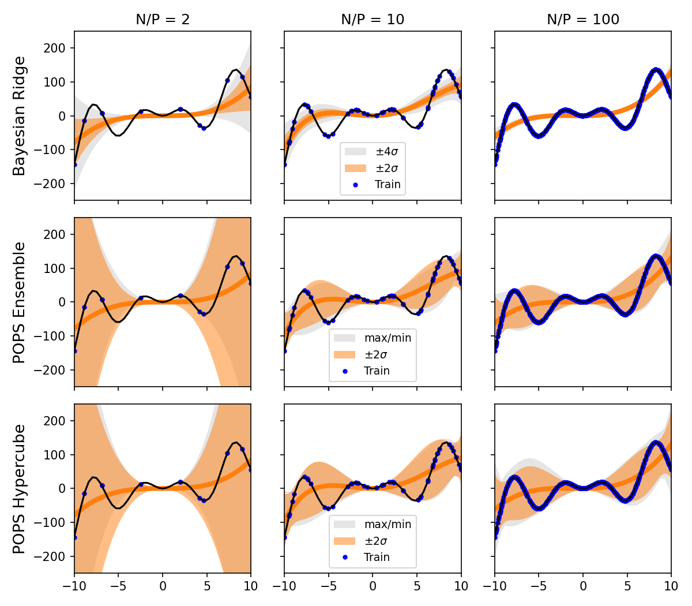

popsregression
=================================================


[](https://codecov.io/gh/tomswinburne/popsregression)


**popsregression** is a [scikit-learn](https://scikit-learn.org) compatible
package providing `POPSRegression`, a Bayesian regression method for low-noise
data that accounts for model misspecification uncertainty.

**Try it out!** [online demo from Kermode group](https://kermodegroup.github.io/demos/regression-demo.html) comparing multiple regression schemes.

## Misspecification-aware Bayesian regression 
Standard Bayesian regression (e.g. `BayesianRidge`) estimates epistemic and
aleatoric uncertainties, but provably ignore model misspecification- errors arising from limited model form (see example below). In the low-noise (weak aleatoric / near-deterministic) limit, weight uncertainties (`sigma_`) are significantly underestimated as they only capture epistemic uncertainty, which decays with increasing data. Any remaining error is attributed to aleatoric noise (`alpha_`), which is erroneous in low-noise settings.

`POPSRegression` efficiently estimates **model misspecification uncertainty**
via the Pointwise Optimal Parameter Sets (POPS) algorithm, finidng parameter perturbations that would fit each training point exactly. 
The result is wider, more honest uncertainty estimates that properly cover the true function, even when the model class cannot perfectly represent the target.

The misspecified, near-deterministic regression problem that `POPSRegression` addresses is particularly relevant to the fitting of surrogate simulation models in computational science, i.e. interatomic potentials,where by construction the optimal surrogate model is structurally unable to capture the target function exactly.

## Example
Fitting a quartic polynomial (P=5 parameters) to a complex oscillatory function with N=10, 50, 500 training points. Top row: BayesianRidge epistemic uncertainty vanishes with more data. Bottom rows: POPS correctly maintains uncertainty where the polynomial deviates from the truth.



See the [SimpleExample.ipynb](SimpleExample.ipynb) notebook for a runnable version.

## Installation

```bash
pip install popsregression
```

**Dependencies**: scikit-learn >= 1.6.1, scipy >= 1.6.0, numpy >= 1.20.0

## Quick start

```python
from popsregression import POPSRegression

X_train, X_test, y_train, y_test = ...

# Fit POPSRegression
# fit_intercept=False by default
model = POPSRegression() 
model.fit(X_train, y_train)

# Prediction with misspecification & epistemic uncertainty
y_pred, y_std = model.predict(X_test, return_std=True)

# Also return min/max bounds over the posterior
y_pred, y_std, y_max, y_min = model.predict(
    X_test, return_std=True, return_bounds=True
)
# Also return epistemic-only uncertainty separately
y_pred, y_std, y_max, y_min, y_epistemic_std = model.predict(
    X_test,
    return_std=True,
    return_bounds=True,
    return_epistemic_std=True,
)
```

## Key parameters

| Parameter | Default | Description |
|---|---|---|
| `posterior` | `'hypercube'` | Posterior form: `'hypercube'` (PCA-aligned box) or `'ensemble'` (raw corrections) |
| `resampling_method` | `'uniform'` | Sampling method: `'uniform'`, `'sobol'`, `'latin'`, `'halton'` |
| `resample_density` | `1.0` | Number of posterior samples per training point |
| `leverage_percentile` | `50.0` | Only use high-leverage training points for POPS posterior |
| `mode_threshold` | `1e-8` | Eigenvalue threshold for hypercube dimensionality |
| `percentile_clipping` | `0.0` | Percentile to clip from hypercube bounds (0–50) |

All `BayesianRidge` parameters (`max_iter`, `tol`, `alpha_1`, `alpha_2`,
`lambda_1`, `lambda_2`, `fit_intercept`, etc.) are also supported.

## Key attributes (after fitting)

| Attribute | Description |
|---|---|
| `coef_` | Regression coefficients (posterior mean) |
| `sigma_` | Epistemic variance-covariance matrix |
| `misspecification_sigma_` | Misspecification variance-covariance matrix from POPS |
| `posterior_samples_` | Samples from the POPS posterior |
| `alpha_` | Estimated noise precision (not used for prediction) |

## Pipeline compatibility

`POPSRegression` is fully compatible with scikit-learn pipelines and
hyperparameter search:

```python
from sklearn.pipeline import make_pipeline

pipe = make_pipeline(
    PolynomialFeatures(degree=4),
    POPSRegression(resampling_method='sobol'),
)
pipe.fit(X_train, y_train)
y_pred = pipe.predict(X_test)
```

## Documentation

Full documentation: https://tomswinburne.github.io/popsregression

## Development

```bash
# Install in development mode
pip install -e .

# Run tests
pytest -vsl popsregression

# With pixi
pixi run test
pixi run lint
pixi run build-doc
```

## Citation

> *Parameter uncertainties for imperfect surrogate models in the low-noise regime*
>
> TD Swinburne and D Perez, [Machine Learning: Science and Technology 2025](http://iopscience.iop.org/article/10.1088/2632-2153/ad9fce)

```bibtex
@article{swinburne2025,
    author={Swinburne, Thomas and Perez, Danny},
    title={Parameter uncertainties for imperfect surrogate models in the low-noise regime},
    journal={Machine Learning: Science and Technology},
    doi={10.1088/2632-2153/ad9fce},
    year={2025}
}
```